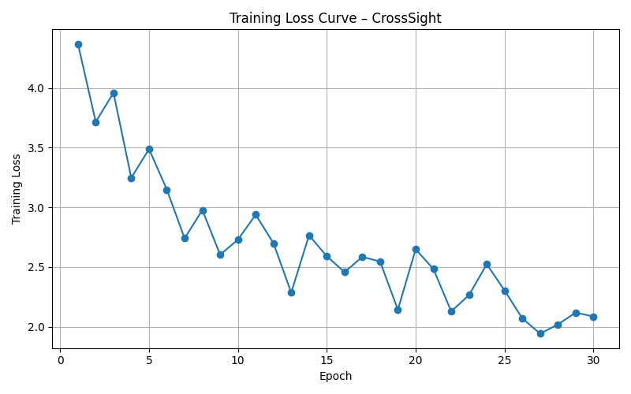
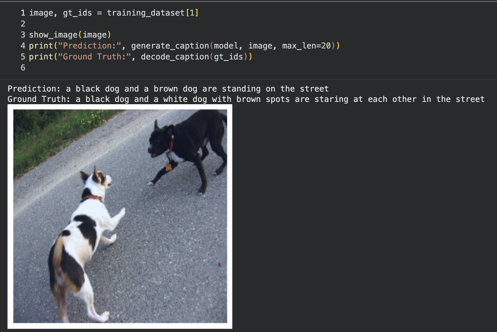
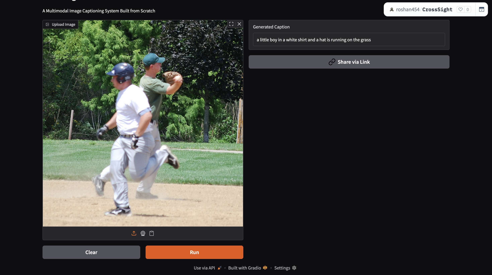
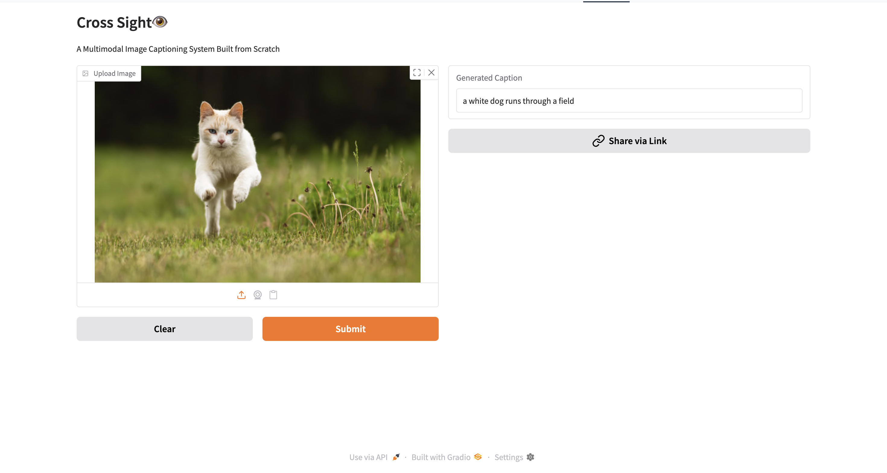
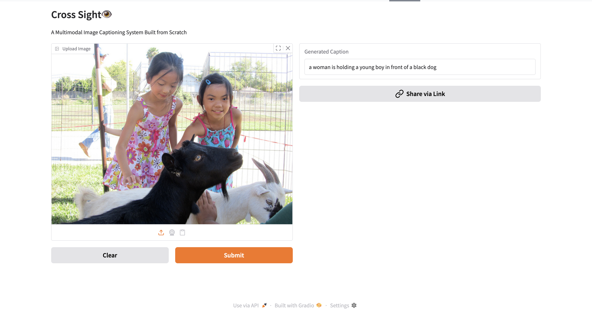

# CrossSight👁️📝 - Image Captioning
A Multimodal Image Captioning System Built From Scratch using PyTorch

CrossSight is an End-to-End Image Captioning System that learns to **see** images and **generates** captions using CNN Encoder and Transformer Based Auto-Regressive Decoder.

The entire architecture is built from scratch using PyTorch , from attention mechanisms - to inference-time decoding , and is Deployed as an interactive web demo using Gradio. 

## Demo💻: 

HuggingFace Spaces: https://roshan454-crosssight.hf.space/?__theme=system&deep_link=6dMURe2Uxjw

This Demo Generates **token-by-token**  animated output captions which is similar to Large Language models generate text in real time.

(Demo_GIF)

## Problem Statement🧐📝: 

Image Captioning is a challenging multi-modal task that requires: 
- Extracting Visual Information from the image.
- Align the Visual Information with language.
- Generate Grammatically Correct and contextually relevant captions.
- Ensuring Autoregressive Generation.

Unlike classification tasks, captioning requires **sequence modeling**, **cross-attention**, and careful handling of training vs inference behavior.

## System Architecture🏛️🏗️:

This System follows a CNN Encoder + Transformer Decoder Architecture: 
#### Image Encoder:
- Image is passed to EfficientNetB0 to extract visual features.
- This Features are passed through a linear projection layer which projects to the Transformer's model dimension.
- The Output from the linear layer is treated as Image Memory which is used for **cross-attention** to generate next token.

#### Caption Decoder: 
- The input tokens are passed with token embeddings + positional embeddings.
- Transformer Decoder has Masked Self-Attention and Cross-Attention over the image memory.
- Linear Projection layer to vocabulary logits.

## Model Details⚙️🔎: 

#### Encoder: 
- Backbone: EfficientNet-B0(Pre-trained).
- Linear Projection Layer gives output as shape (B,1,512)

#### Decoder: 
- Transformer Decoder(6 layers , 8 heads).
- Uses Causal Masking to prevent seeing the future tokens.
- Cross-Attention with the Image Memory from the Encoder.

## Training 🛠️🔄: 

- Teacher Forcing is used during Training.
- Captions are shifted:
  - Input: "<START> a little girl riding a bike
  - Output: " a little girl riding a bike <STOP>" 
- CrossEntropy Loss is computed across all timestep.
- '<PAD>' tokens are ignored during loss computation.

## Inference 📝🤔💬:

During Inference:
- Generation is started with <START> token.
- Model Predict One Token at a time.
- Each Token is appended to the input sequence.
- Generation stops at <END> or max_length reaches.

This replicates how GPT-style Language models generate text.

## Results📊:

#### Training Loss Curve📉:

**Observation🔬📝:**  
- Loss is steadily Decreasing overall.
- Some noise is expected due to small dataset size and Autoregressive sequence learning. 

### Qualitative Example(Seen Data):

**Prediction:**  
> a black dog and a brown dog are standing on the street

**Ground Truth Caption:**  
> a black dog and a white dog with brown spots are staring at each other in the street

**Observation🔬📝:** 
Even when exact wording differs:
- Model correctly identifies the main entities (two dogs)
- the scene (street), and their interaction.  
- shows attributes such as coat color and exact action.

### Qualitative Results(Unseen Data):

To evaluate real-world performance, CrossSight was tested on images **not seen during training**, including samples from the COCO dataset and internet images.

Below are example predictions generated by the deployed Gradio demo.

**Example 1**

**Example 2**

**Example 3**

**Example 4**

### Observations: 

- The model correctly identifies **primary objects** (people, dogs, animals).
- Simple **actions** such as *running*, *playing*, or *holding* are captured well.
- Captions are generally fluent and grammatically correct.

However:
- The model sometimes **misidentifies object types** (e.g., cat → dog).
- Fine-grained distinctions (goat vs dog, baseball vs general play) are challenging.
- This behavior is expected given the limited training data and vocabulary.

## Limitations and Future Improvements: 

### **Limitations⚠️**

- 1. Single Global Image Representation

  The CNN encoder compresses the entire image into a single vector, which limits fine-grained spatial understanding and object-level reasoning.

- 2. Limited Training Data

  Training on a relatively small dataset restricts vocabulary richness and complex scene understanding.

- 3. Greedy Decoding

  The model uses greedy decoding, which can lead to:
	•	Less descriptive captions
	•	Missed alternative phrasings

- 4. Exposure Bias

  The gap between teacher forcing (training) and autoregressive generation (inference) can cause early mistakes to propagate.
  
### **Future Improvements📈🔨:**

  

